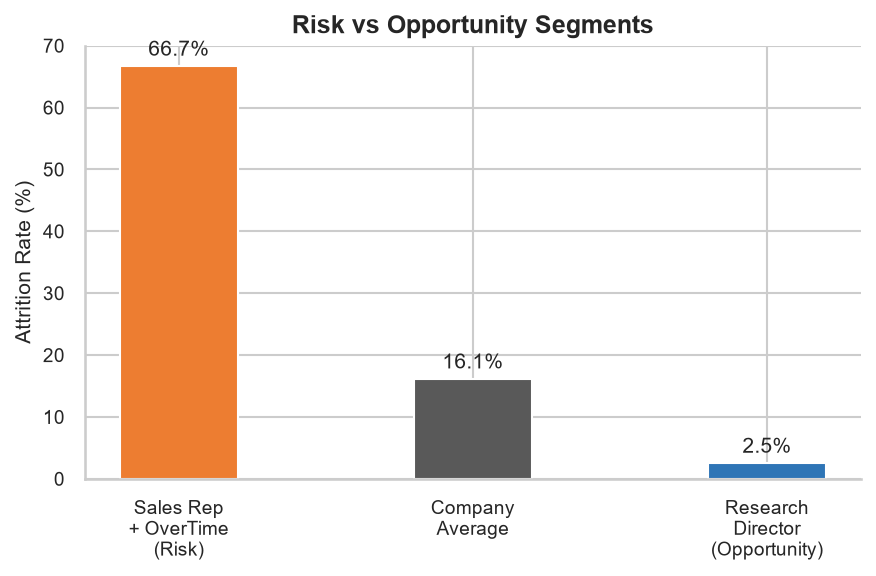
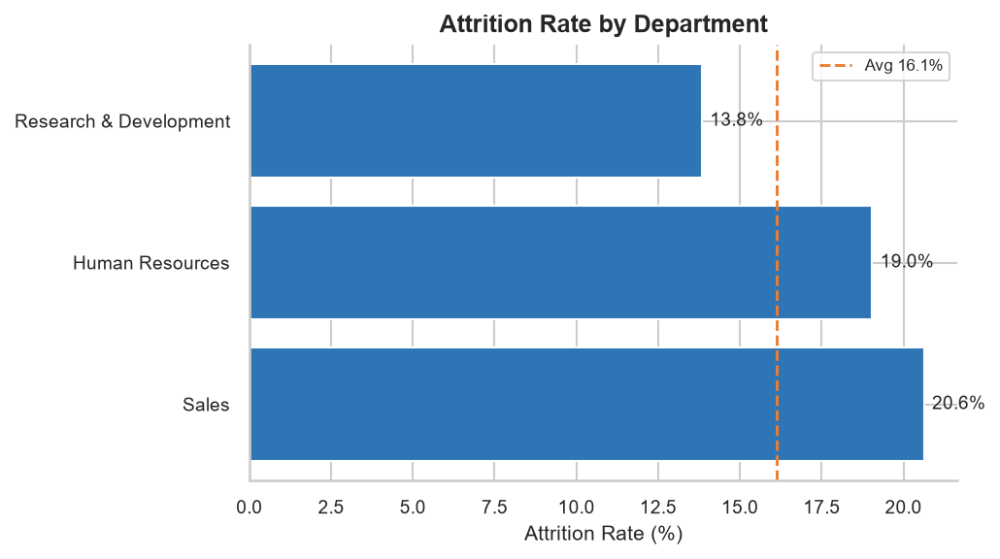
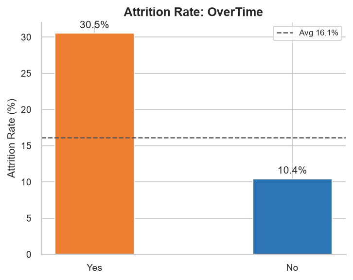

# HR Employee Attrition – Data Analytics Project

A Python-based business intelligence analysis of employee attrition using IBM's HR dataset.
Produces 10 publication-ready charts and an auto-generated Word report, all from a single script.

---

## Project Structure

```
HR-Attrition-Project/
├── KhushiVig_HRAttritionAnalysis.py   # Main analysis script (run this)
├── requirements.txt              # Python dependencies
├── README.md                     # This file
├── WA_Fn-UseC_-HR-Employee-Attrition.csv   # Dataset (see link below)
├── KhushiVig_ProjectReport.docx       # Auto-generated Word report (created on run)
└── charts/                       # Auto-generated PNG charts (created on run)
    ├── 01_attrition_by_department.png
    ├── 02_attrition_by_jobrole.png
    ├── 03_attrition_by_agegroup.png
    ├── 04_attrition_by_incomeband.png
    ├── 05_driver_overtime.png
    ├── 06_driver_jobsatisfaction.png
    ├── 07_driver_worklifebalance.png
    ├── 08_driver_promotion.png
    ├── 09_driver_distance.png
    └── 10_risk_opportunity.png
```

---

## What It Analyses

| Section | Content |
|---|---|
| **Executive Overview** | Attrition rate, avg income, avg tenure, overtime rate, avg job satisfaction |
| **Attrition Trends** | Breakdown by Department, Job Role, Age Group, Income Band |
| **Drivers of Attrition** | OverTime, Job Satisfaction, Work-Life Balance, Promotion lag, Distance from home |
| **Risk / Opportunity / Action** | Highest-risk segment, highest-opportunity segment, recommended business action |

---

## How to Run

### 1. Clone / download the repository

```bash
git clone <your-repo-url>
cd HR-Attrition-Project
```

### 2. Install dependencies

```bash
pip install -r requirements.txt
```

> Python 3.9+ recommended.

### 3. Place the dataset

Download the dataset and place it in the project root as:

```
WA_Fn-UseC_-HR-Employee-Attrition.csv
```

**Dataset link:** https://www.kaggle.com/datasets/pavansubhasht/ibm-hr-analytics-attrition-dataset

### 4. Run the analysis

```bash
python KhushiVig_HRAttritionAnalysis.py
```

**Output:**
- `charts/`: 10 PNG chart files
- `KhushiVig_ProjectReport.docx`: full business report with embedded charts

---

## Key Findings (Summary)

- Overall attrition rate: **16.1%** (above the typical 10–12% industry benchmark)
- **Sales Representatives working overtime** are the highest-risk segment (**66.7% attrition**)
- **Research Directors** are the most stable, high-value segment (**2.5% attrition**)
- Primary lever: reducing mandatory overtime in the Sales department

### Charts

**Risk vs Opportunity Segments**


**Attrition Rate by Department**


**Attrition Rate: OverTime Driver**


---

## Libraries Used

| Library | Purpose |
|---|---|
| `pandas` | Data loading and manipulation |
| `numpy` | Numeric operations |
| `matplotlib` | Chart rendering |
| `seaborn` | Styled chart themes |
| `python-docx` | Word report generation |

---

## License

For educational and portfolio use.
